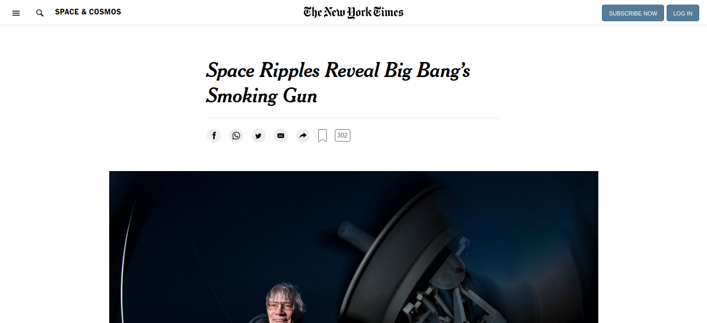

# Microverse - Week 1 Positioning and Floating

> A project that explores using various css positioning techniques (float, flex and grid).

## Uses With

- Flex Box
- CSS Grid
- Floating Elements

## Authors

👤 **Joshua Ivie**

- GitHub: [@joshuaivie](https://github.com/joshuaivie)
- Twitter: [@joshuaivie\_](https://twitter.com/joshuaivie_)
- LinkedIn: [joshuaivie](https://linkedin.com/in/joshuaivie)

## 🤝 Contributing

Contributions, issues, and feature requests are welcome!
Feel free to check the [issues page](issues/).

## Show your support

Give a ⭐️ if you like this project!

## Acknowledgments

- Hat tip to anyone whose code was used
- Inspiration
- etc

## 📝 License

This project is [MIT](lic.url) licensed.
